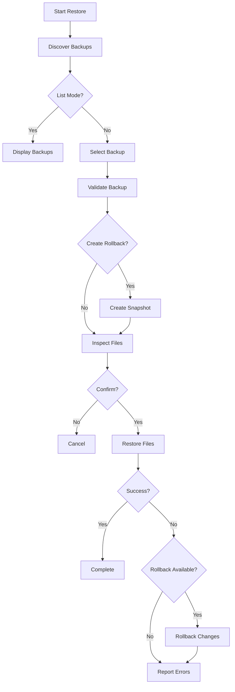

The `restore` command restores your `.env*` files from backups created by the `sync` command. It features automatic backup discovery, validation, rollback capability, and comprehensive error handling.

## Usage

```bash
env-twin restore [timestamp] [options]
```

## Key Features

<CardGroup cols={2}>
  <Card title="Auto-Discovery" icon="magnifying-glass">
    Automatically finds and selects the most recent valid backup when no timestamp is provided
  </Card>
  
  <Card title="Backup Validation" icon="shield-check">
    Validates backup integrity and completeness before restoration
  </Card>
  
  <Card title="Rollback Protection" icon="rotate-left">
    Creates pre-restore snapshots for automatic recovery if restoration fails
  </Card>
  
  <Card title="Cross-Platform" icon="laptop-mobile">
    Works seamlessly on Windows, macOS, and Linux
  </Card>
</CardGroup>

## Arguments

<ParamField path="timestamp" type="string">
  Specific backup timestamp to restore (format: `YYYYMMDD-HHMMSS`)
  
  If omitted, the most recent valid backup will be automatically selected.
  
  **Example:**
  ```bash
  env-twin restore 20241125-143022
  ```
</ParamField>

## Options

<ParamField path="--yes" type="flag">
  Skip confirmation prompt and proceed with restoration immediately
  
  **Aliases:** `-y`
  
  **Example:**
  ```bash
  env-twin restore --yes
  ```
</ParamField>

<ParamField path="--list" type="flag">
  List all available backups without performing a restore
  
  Displays:
  - Valid backups with timestamps and file lists
  - Invalid backups with error messages
  - Usage examples for restoration
  
  **Example:**
  ```bash
  env-twin restore --list
  ```
</ParamField>

<ParamField path="--preserve-permissions" type="flag">
  Preserve original file permissions during restoration
  
  When enabled, files are restored with the same permissions they had when backed up.
  
  **Example:**
  ```bash
  env-twin restore --preserve-permissions
  ```
</ParamField>

<ParamField path="--preserve-timestamps" type="flag">
  Preserve original file modification timestamps
  
  When enabled, restored files maintain their original modification times from the backup.
  
  **Example:**
  ```bash
  env-twin restore --preserve-timestamps
  ```
</ParamField>

<ParamField path="--create-rollback" type="flag">
  Create a pre-restore snapshot for rollback capability
  
  **Aliases:** `--rollback`
  
  If the restore operation fails, the snapshot can be used to automatically rollback to the pre-restore state.
  
  **Example:**
  ```bash
  env-twin restore --create-rollback
  ```
</ParamField>

<ParamField path="--force" type="flag">
  Force restore without checking for file changes
  
  **Aliases:** `-f`
  
  Bypasses safety checks that normally warn about existing file modifications.
  
  <Warning>
    This may overwrite uncommitted changes. Use with caution!
  </Warning>
  
  **Example:**
  ```bash
  env-twin restore --force
  ```
</ParamField>

<ParamField path="--dry-run" type="flag">
  Show what would be restored without making any actual changes
  
  **Aliases:** `--simulate`
  
  Perfect for previewing the restore operation before committing to it.
  
  **Example:**
  ```bash
  env-twin restore --dry-run
  ```
</ParamField>

<ParamField path="--verbose" type="flag">
  Enable verbose logging for detailed operation information
  
  **Aliases:** `-V`
  
  Provides detailed progress information, file-by-file status, and debugging information.
  
  **Example:**
  ```bash
  env-twin restore --verbose
  ```
</ParamField>

<ParamField path="--help" type="flag">
  Display help information for the restore command
  
  **Aliases:** `-h`
  
  **Example:**
  ```bash
  env-twin restore --help
  ```
</ParamField>

## Examples

<Accordion title="Restore most recent backup (automatic)">
  The simplest way to restore - automatically selects the most recent valid backup:
  
  ```bash
  env-twin restore
  ```
  
  **Output:**
  ```
  🔄 Starting enhanced restore process...

  📁 Discovering available backups...
  🎯 Auto-selected most recent backup: 2024-11-25 14:30:22 (2 hours ago)

  🔍 Inspecting selected backup...
     ⚠️  .env exists (last modified: 2024-11-25T16:15:30Z)
     ⚠️  .env.local exists (last modified: 2024-11-25T16:15:30Z)
     ✅ .env.example will be created

  📋 Restore Operation Summary:
     Backup: 2024-11-25 14:30:22 (2 hours ago)
     Files to restore: .env, .env.local, .env.example

  ❓ Do you want to proceed with the restore? (y/N)
  Answer: y

  🚀 Starting restore operation...

     33% - Restoring: .env
     66% - Restoring: .env.local
     100% - Restoring: .env.example

  📊 Restore Results:
     ✅ Successfully restored: 3 files

  🎉 Restore operation completed successfully!
  ```
</Accordion>

<Accordion title="Restore specific backup timestamp">
  Restore a specific backup by providing its timestamp:
  
  ```bash
  env-twin restore 20241125-143022
  ```
  
  **Output:**
  ```
  🔄 Starting enhanced restore process...

  📁 Discovering available backups...
  🎯 Selected specific backup: 2024-11-25 14:30:22 (2 hours ago)

  🔍 Inspecting selected backup...
     ⚠️  .env exists (last modified: 2024-11-25T16:15:30Z)
     ✅ .env.local will be created

  📋 Restore Operation Summary:
     Backup: 2024-11-25 14:30:22 (2 hours ago)
     Files to restore: .env, .env.local

  ❓ Do you want to proceed with the restore? (y/N)
  ```
</Accordion>

<Accordion title="List available backups">
  View all available backups without restoring:
  
  ```bash
  env-twin restore --list
  ```
  
  **Output:**
  ```
  📋 Available backups:

  ✅ Valid backups:
     1. 2024-11-25 16:30:22 (30 minutes ago)
        Files: .env, .env.local, .env.example
        Created: 2024-11-25T16:30:22.000Z

     2. 2024-11-25 14:30:22 (2 hours ago)
        Files: .env, .env.local, .env.example
        Created: 2024-11-25T14:30:22.000Z

     3. 2024-11-24 09:15:00 (1 day ago)
        Files: .env, .env.local
        Created: 2024-11-24T09:15:00.000Z

  💡 Usage examples:
     env-twin restore                    # Restore most recent (20241125-163022)
     env-twin restore 20241125-163022    # Restore specific backup
     env-twin restore --list             # List all backups
  ```
</Accordion>

<Accordion title="Restore with confirmation skip">
  Skip the confirmation prompt using `--yes`:
  
  ```bash
  env-twin restore --yes
  ```
  
  or with a specific timestamp:
  
  ```bash
  env-twin restore 20241125-143022 --yes
  ```
  
  This is useful for:
  - Automated scripts
  - CI/CD pipelines
  - Quick emergency restores
</Accordion>

<Accordion title="Dry-run to preview changes">
  Preview what would be restored without making changes:
  
  ```bash
  env-twin restore --dry-run
  ```
  
  **Output:**
  ```
  🔄 Starting enhanced restore process...

  📁 Discovering available backups...
  🎯 Auto-selected most recent backup: 2024-11-25 14:30:22 (2 hours ago)

  🔍 Inspecting selected backup...
     ⚠️  .env exists (last modified: 2024-11-25T16:15:30Z)
     ⚠️  .env.local exists (last modified: 2024-11-25T16:15:30Z)

  📋 Restore Operation Summary:
     Backup: 2024-11-25 14:30:22 (2 hours ago)
     Files to restore: .env, .env.local
     Mode: DRY RUN (no actual changes will be made)

  ❓ Do you want to proceed with the restore? (y/N)
  Answer: y

  🚀 Starting restore operation...

     50% - [DRY RUN] Would restore: .env
     100% - [DRY RUN] Would restore: .env.local

  📊 Restore Results:
     ✅ Would restore: 2 files

  🎉 Dry run completed successfully!
  ```
</Accordion>

<Accordion title="Restore with rollback protection">
  Create a pre-restore snapshot for automatic recovery:
  
  ```bash
  env-twin restore --create-rollback
  ```
  
  If the restore fails, the snapshot will be automatically used to rollback:
  
  ```
  📸 Creating pre-restore snapshot...
     ✅ Snapshot created: restore-1732546822000-a1b2c3d4e5f6g7h8

  🚀 Starting restore operation...

     50% - Restoring: .env
     ❌ Failed to restore .env: Permission denied

  🔄 Restore failed, initiating rollback...
  ✅ Rollback completed successfully

  ❌ Restore operation completed with errors
  ```
</Accordion>

<Accordion title="Advanced restore with multiple options">
  Combine multiple options for maximum control:
  
  ```bash
  env-twin restore --create-rollback --preserve-permissions --preserve-timestamps --verbose
  ```
  
  This will:
  1. Create a rollback snapshot before restoring
  2. Preserve original file permissions
  3. Preserve original file timestamps
  4. Show detailed logging throughout the process
</Accordion>

<Accordion title="Force restore (override warnings)">
  Force restoration even if files have been modified:
  
  ```bash
  env-twin restore --force
  ```
  
  <Warning>
    This will overwrite any existing files without checking if they've been modified since the backup. Use with caution!
  </Warning>
</Accordion>

## Restore Process Flow

The restore command follows a comprehensive process:



## Backup Validation

Before restoration, env-twin validates each backup:

- **Structure Check**: Verifies backup directory structure
- **Timestamp Format**: Validates timestamp format (`YYYYMMDD-HHMMSS`)
- **File Existence**: Confirms all backup files exist
- **File Integrity**: Checks files are readable and not corrupted
- **Metadata Validation**: Ensures backup metadata is complete

<Note>
  Invalid backups are excluded from automatic selection but are shown in `--list` output with error details.
</Note>

## Rollback Capability

When using `--create-rollback`, env-twin creates a snapshot before restoration:

1. **Pre-Restore Snapshot**: Captures current state of all files
2. **Metadata Storage**: Stores file permissions, timestamps, and content
3. **Automatic Recovery**: If restore fails, automatically reverts to snapshot
4. **Manual Rollback**: Snapshot can be manually restored if needed

**Snapshot Limitations:**
- Maximum file size: 1MB per file
- Files larger than 1MB are skipped with a warning
- Snapshots are temporary and cleaned up after successful restore

## Best Practices

<AccordionGroup>
  <Accordion title="Always preview with --dry-run first">
    Before restoring in production, preview the changes:
    
    ```bash
    env-twin restore --dry-run
    # Review the output
    env-twin restore --yes  # Only if dry-run looks good
    ```
  </Accordion>
  
  <Accordion title="Use --create-rollback for safety">
    Enable rollback protection for critical environments:
    
    ```bash
    env-twin restore --create-rollback --verbose
    ```
  </Accordion>
  
  <Accordion title="List backups before restoring">
    Check available backups before restoration:
    
    ```bash
    env-twin restore --list
    env-twin restore 20241125-143022
    ```
  </Accordion>
  
  <Accordion title="Preserve file metadata">
    Keep original permissions and timestamps:
    
    ```bash
    env-twin restore --preserve-permissions --preserve-timestamps
    ```
  </Accordion>
</AccordionGroup>

## Related Commands

<CardGroup cols={2}>
  <Card title="sync" icon="arrows-rotate" href="/commands/sync">
    Sync command that creates the backups
  </Card>
  
  <Card title="clean-backups" icon="trash" href="/commands/clean-backups">
    Manage and clean old backups
  </Card>
</CardGroup>

## Troubleshooting

<AccordionGroup>
  <Accordion title="No backups found">
    **Problem:** Command reports "No backups found in .env-twin/ directory"
    
    **Solution:** Run `env-twin sync` first to create a backup:
    
    ```bash
    env-twin sync
    env-twin restore --list
    ```
  </Accordion>
  
  <Accordion title="Invalid backup timestamp">
    **Problem:** "Backup with timestamp 'X' not found or invalid"
    
    **Solution:** List available backups and use a valid timestamp:
    
    ```bash
    env-twin restore --list
    env-twin restore [valid-timestamp]
    ```
  </Accordion>
  
  <Accordion title="Permission denied during restore">
    **Problem:** Cannot write to .env files
    
    **Solution:** Check file permissions and ownership:
    
    ```bash
    ls -la .env*
    chmod 644 .env*
    ```
    
    Or use `--force` to override (not recommended):
    
    ```bash
    env-twin restore --force
    ```
  </Accordion>
  
  <Accordion title="Restore fails mid-operation">
    **Problem:** Restore fails partway through
    
    **Solution:** If you used `--create-rollback`, the rollback happens automatically. Otherwise, restore the previous backup:
    
    ```bash
    env-twin restore --list  # Find the previous backup
    env-twin restore [previous-timestamp]
    ```
  </Accordion>
</AccordionGroup>